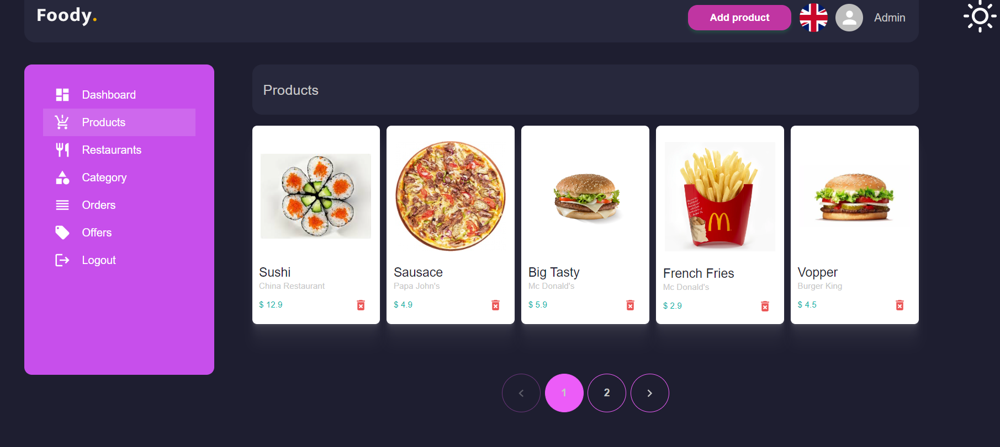
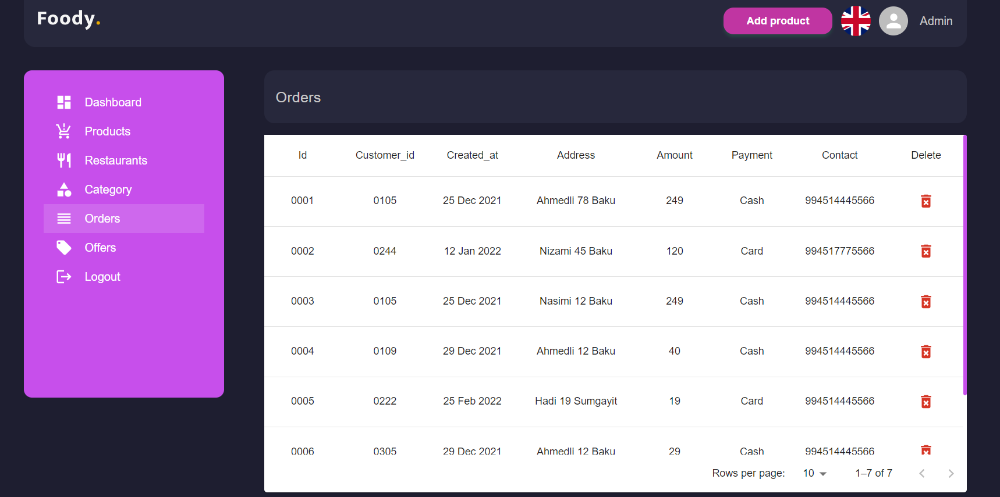
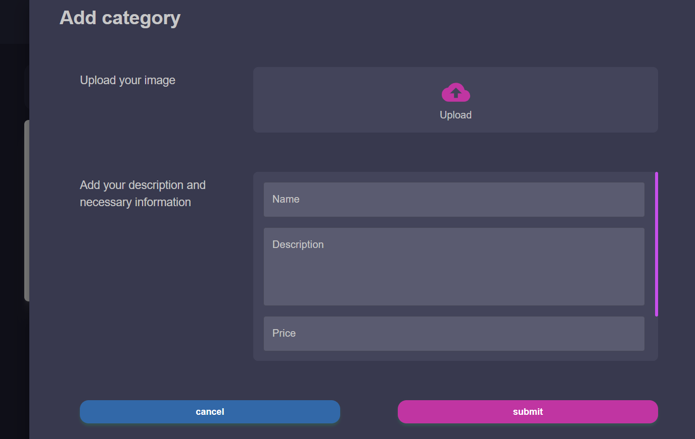
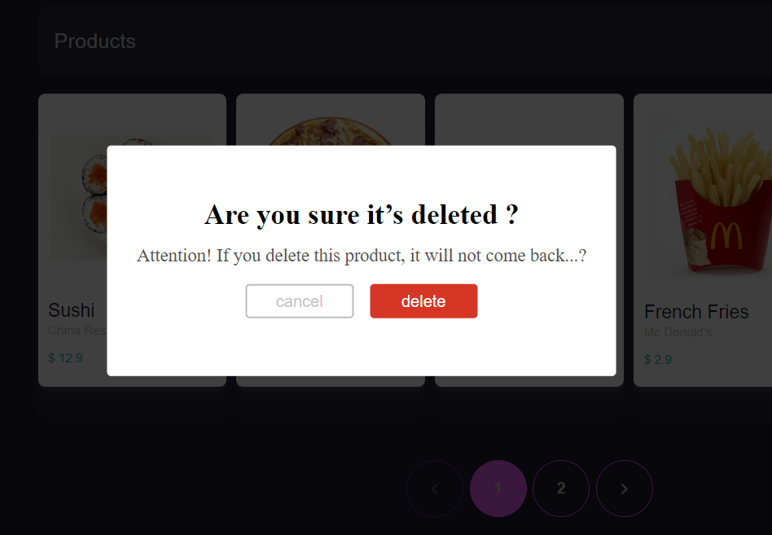

# Admin foody delivety

To view a live example, [click here](https://foody-admin.vercel.app/panel/dashboard)

## Features
* Responsive Desing 
* Fast Interface
* Admin
* Simple usage

## Pages
✔️ Dashboard ✔️ Products ✔️ Reataurant ✔️ Category ✔️ Orders ✔️ Offers ✔️ Logout

## Technologies Used
* React Js
* Redux Toolkit
* Styled-components
* Material UI
* Axios
* Formik
* Yup
* React-i18next

## Products

## Table

## Form

## Table

